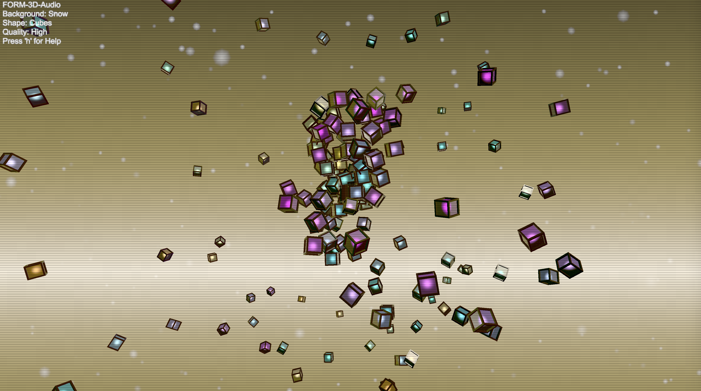

# Form3D-Audio
An audio reactive toy based on the old 90's DOS Genetic Art program 'Form' by Andrew Rowbottom. Re-developed in Unity 5 it demonstrates the use of custom shaders within the Unity framework.

CoreShader: Implements bespoke ambient, diffuse and specular lighting with environmental fresnel reflections. The core also implements a glow effect that is responsive to the music playing. 

FrameShader: Implements bespoke ambient, diffuse and specular lighting with environmental fresnel reflections.

BackgroundShader: The background shader is displayed on a simple quad (not a lightbox) that is resposive to the camera position.

LensShader: Provides a VGA monitor and scene transition effects.

All of these shaders are implemented as Unlit shaders (all lighting is calculated within the shader) thus reducing some the overhead of the Unity rendering pipeline.

PC & Mac distibutions are provided in the /dist folder 